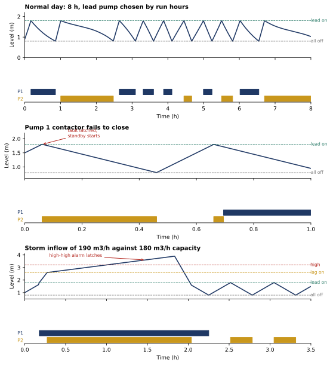

# PLC Pump Station: IEC 61131-3 Structured Text on a Simulated Plant

[](https://github.com/fatinnihal532-hub/plc-pump-station/actions/workflows/ci.yml)
[](https://colab.research.google.com/github/fatinnihal532-hub/plc-pump-station/blob/main/run_in_colab.ipynb)

The control program for a duty/standby wet-well pump station, written in IEC 61131-3 Structured Text, together with
the tool that runs it. No PLC or licence is needed. A small Structured Text interpreter (`plcsim/st.py`) executes the
real `.st` file scan by scan against a simulated well, two pumps and their contactors, so every behaviour below is
tested on the program itself and not on a Python copy of it.

The program ([`st/pump_station.st`](st/pump_station.st), 133 lines) handles:

* level control with hysteresis: lead pump at 1.8 m, lag pump at 2.6 m, all off at 0.8 m
* run-hour equalisation: each pumping cycle starts with the pump that has run less
* a 30 s minimum run time to stop motor short cycling
* fail-to-start and welded-contactor detection: 3 s of disagreement between command and feedback latches a fault,
  and the standby takes over at once
* dry-run cut-out below 0.4 m for 5 s, released above 1.0 m
* high and high-high level alarms, the latter latched until acknowledged, plus a horn
* auto and manual modes, with the e-stop, dry-run and fault interlocks still applied in manual

```
IF lead_is_1 THEN
  IF n_req >= 1 AND avail1 THEN auto1 := TRUE; END_IF;
  IF n_req >= 2 AND avail2 THEN auto2 := TRUE; END_IF;
  IF n_req >= 1 AND NOT avail1 AND avail2 THEN auto2 := TRUE; END_IF;   (* standby takes the lead role *)
ELSE
  ...
```

## What the simulation shows



| Scenario | Result |
|---|---|
| 8 h normal day, sinusoidal inflow of 35 to 85 m3/h | level stays between 0.80 and 1.80 m; pump 1 starts 6 times and pump 2 four times, running 2.42 h and 3.29 h; no alarms; at most 6 starts per hour |
| Pump 1 contactor fails to close | fault latched 3.00 s after the command, standby pump 2 running 1.0 s later (including its speed ramp), level peaks at 1.80 m |
| Storm: 190 m3/h against 180 m3/h capacity for 100 min | both pumps run flat out, high-high alarm at 88 min, peak 3.90 m against a 4.00 m spill level, no overflow, alarm stays latched until acknowledged |
| Dry-run in manual | pumps cut out at the low-low level and the well never falls below 0.38 m |
| E-stop | both commands drop within one scan |

The plant model is deliberately simple: a prismatic well of 12 m2, two pumps of 90 m3/h with a 2 s speed ramp and
a 0.5 s contactor auxiliary delay, and transmitter noise of 2 mm. It is a test bench for the logic, not a hydraulic
model of a real station.

## The interpreter

`plcsim/st.py` is a from-scratch parser and evaluator, about 500 lines, for the subset of Structured Text this kind
of program uses:

* declarations: `VAR_INPUT`, `VAR_OUTPUT`, `VAR`, `VAR CONSTANT`; types BOOL, INT, DINT, REAL and TIME
* statements: assignment, `IF / ELSIF / ELSE`, `CASE`, function block calls
* standard blocks with scan-accurate timing: TON, TOF, TP, R_TRIG, F_TRIG, SR, RS
* IEC operator precedence, integer division that truncates toward zero, `MOD`, and functions ABS, MIN, MAX, LIMIT, SEL, SQRT
* static checks: undeclared names, writes to inputs or constants, duplicate declarations, unknown function block ports
  and unsupported syntax are all rejected with a line number instead of being ignored

It does not support user function blocks, arrays, structures or loops. Real PLC code should be tested on the vendor
runtime as well.

## How the results are checked

`python verify.py` runs 12 checks and `pytest` runs 35 tests:

* the interpreter: operator precedence, integer division and `MOD` signs, timer timing to the scan (a 1.5 s TON is
  true on the 15th 100 ms scan), TOF and TP behaviour, edge detection, latch dominance, persistent state, comments
  and case-insensitive keywords, 11 kinds of static error and 4 kinds of runtime error
* the station: level band, both pumps used, run hours within one pumping cycle of each other, start limits, minimum
  run time under a deliberately tiny well, fail-to-start timing, a premature acknowledge that must not clear a live
  fault, welded contactor, storm and latch, dry-run in manual, e-stop and resume, manual interlocks, and the case
  where both pumps are faulty (alarm, no pump started, well allowed to rise)

## Run it

```bash
pip install -r requirements.txt
python -m pytest -q
python verify.py
python make_figures.py    # docs/scenarios.svg and results/normal_day.csv
```

```python
from plcsim.plant import Station, steady
s = Station(steady(70.0), level0=1.5)
s.run(3600, [(1800, lambda st: setattr(st.pumps[1], "welded", True))])   # weld pump 2 at 30 min
print(s.out["fault2"], s.max_level)
```

## Layout

```
st/pump_station.st     the control program (IEC 61131-3 Structured Text)
plcsim/st.py           Structured Text parser and scan-cycle interpreter
plcsim/plant.py        wet well, pumps and contactors, closed around the PLC
plcsim/scenarios.py    the named scenarios used by the tests, verify.py and the figure
verify.py              checks behind every number in this README
```

---
Fatin Nihal Islam · EEE, KUET · [Portfolio](https://fatinnihal532-hub.github.io) · [LinkedIn](https://www.linkedin.com/in/fatin-nihal-islam2002)
